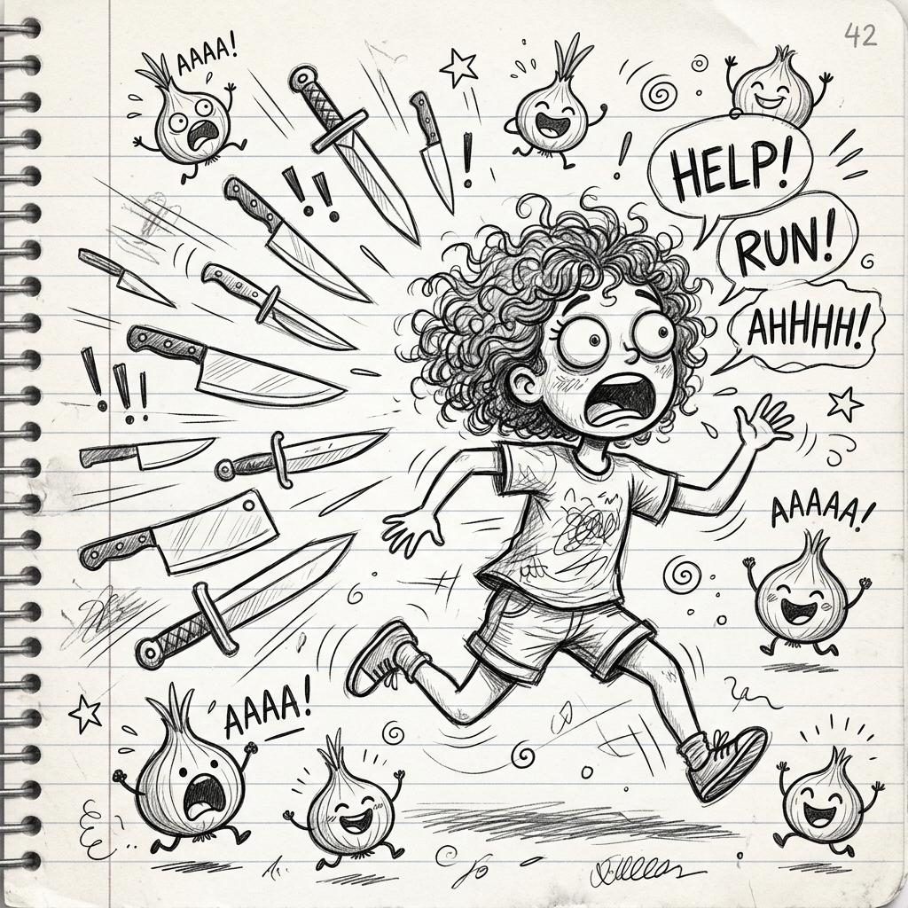

# ഉള്ളി Dino (Ulli Dino) 🧅🏃‍♀️⚔️

A hand-drawn sketchbook doodle runner inspired by the Chrome Dino game, featuring the quirky short curly-haired girl and her running onion companion!



---

## 🎮 Game Features

- **Unique Hand-Drawn Doodle Aesthetic**: Entire game built in a spiral-bound notebook sketchbook with authentic line-boil wobble animations, margin doodles, pencil dust particles, and interactive margin elements.
- **Animated Malayalam Title**: Eye-catching animated **"ഉള്ളി Dino"** full-page opening title sequence with floating blade orbits.
- **Dynamic Obstacles**: Dodge kitchen knives, cleavers, chef's knives, broadswords, and duck under flying scimitars and spinning shurikens.
- **Custom Sound Effects**: Zero-latency procedural cartoon sound engine (spring jump boing, metallic sword collisions) plus custom sound effects (`Crash.ogg`).
- **Chilli Booster Power-Up**: Rarely spawns high in the air as an optional bonus for 2X turbo speed and double score multipliers.
- **Mobile Responsive & Touch-Optimized**: Features dedicated large on-screen **`🦘 TAP TO JUMP`** and **`🦆 DUCK`** buttons for phones and tablets, plus direct screen tap jumping with zero delay.

---

## 🕹️ Controls

| Action | Keyboard | Mobile / Touch |
| :--- | :--- | :--- |
| **Jump** | <kbd>SPACE</kbd> / <kbd>▲ UP</kbd> / <kbd>W</kbd> | Tap Screen or **`🦘 TAP TO JUMP`** button |
| **Duck / Slide** | <kbd>▼ DOWN</kbd> / <kbd>S</kbd> | Press **`🦆 DUCK`** button |
| **Restart** | <kbd>SPACE</kbd> / <kbd>▲ UP</kbd> / <kbd>ENTER</kbd> | Tap **`🔄 PLAY AGAIN`** button |

---

## 🚀 Running Locally

Open `index.html` directly in any modern browser, or run a local HTTP server:

```bash
# Python
python -m http.server 8080

# Node.js
npx serve .
```

Then visit [http://localhost:8080](http://localhost:8080).